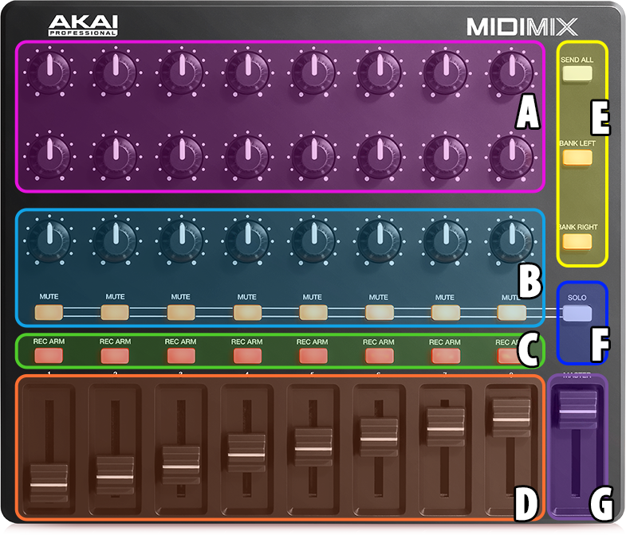
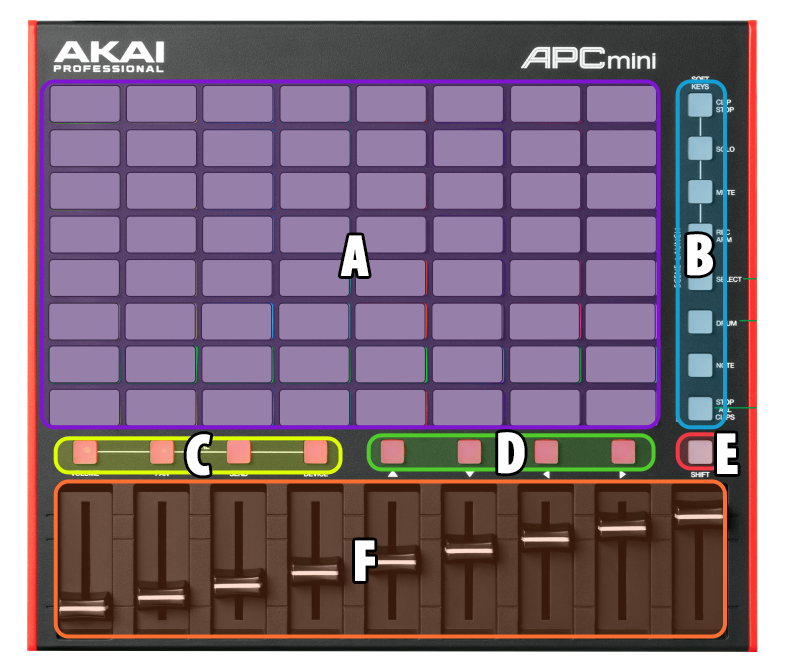

# Enrohk FL Machine Scripts
Actually, for making music, I use FL Studio's performance mode along with a few MIDI controllers to handle the workflow.
The full list of controllers I have:
- Akai Fire (discontinued from shops)
- [Akai Midimix](https://www.thomann.es/akai_professional_midimix.htm)
- [Akai APC Mini MK2](https://www.thomann.es/akai_professional_apc_mini_mk2.htm)
- Alesis VMini (also discontinued)
Most of the time with the APC Mini and the Midimix, I get enough control for the session, but sometimes I need a way to edit percussion or patterns on the fly, so I add the Fire to the bundle.
The VMini is when I want to play the synth live on the fly (very rarely), and I plan to build an additional controller in Arduino to have some different ways to control things.

This is the main purpose of each machine:

###Akai Midimix:
With this, I control the mixer and some effects.

- A: High and Low Pass for each mixer bus
- B: FX On/Off and Control Knob for the FX
- C: Mute/solo switched to this row
- D: Mixer volume fader for each mixer bus
- E: Send All and plans for expansions ;)
- F: Switch between Mute or Solo for C
- G: Master volume fader

###Akai APC Mini MK2:
The 4x12 button pattern of the Akai Fire is good for handle patterns, but not the entire session workflow, so I get this one to handle that.

- A: Pattern Launch
- B: Unused
- C: Play / Stop controls and a little animation ;)
- D: Focus pattern
- E: Unused
